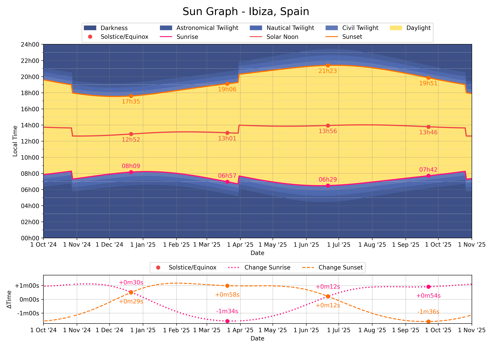

# Sun Graph

Generate a graph showing sunrise and sunset times for the next year.

## Install

```sh
uv sync
```

## Run

```sh
$ uv run main.py --help
Usage: main.py [OPTIONS] LOCATION_NAME

  Generate sun graphs for LOCATION_NAME.

Options:
  --recalculate  Recalculate sunrise and sunset times.
  --help         Show this message and exit.
```

```sh
$ uv run main.py ibiza
```

Generates:

- PDF (printable A4): [sun-graph_ibiza-spain.pdf](docs/sun-graph_ibiza-spain.pdf)
- PNG (display):
  

## Configuration

Additional locations can be added to `locations.yaml` by duplicating and changing the existing entry.

Additional events, such as solstices and equinoxes, can be added to `config.yaml` under `events`.

## Lint

```sh
uvx ruff format
uvx ruff check --fix
uvx mypy .
```
